# Next Destination Club Holiday App

[View Live Project Here](https://next-destination-milestone-3.herokuapp.com/)

## Data Centric Development Milestone 3 project.

### Overview

This project presents a Holidays destiantions call Next destination Club. This is a website/app where User  can find and save their best destinations all around the world, User will able to create a account to see all destination or to save their own Holidays.Once user got login details next step is to update profile with add destination or to look around app to see the existing destination and other features.I have designed this project, fully focus on Database creation, security and CRUD(create, read, update and delete).App has a few diffrent webpages each page has different contents and buttons but as user prospective each webpage will easily and smoothly will navigate user to their destination.

##  Screenshots of project

# Desktop, Ipad & Mobile

# Highlights

 * [User Experience (UX)](#User-experience-UX)
    
    * [User Desire](#user-desire)
     
    * [User Stories](#user-stories)

    * [Wireframes of website](#wireframes-of-website)

    * [Design](#design)
       
        * [Colors](#colors)

        * [Typography](#typography)

        * [Imagery](#imagery)

        * [Icons](#icons)

    * [Database Model](#database-model) 

    * [Features](#features)

    * [Technology used in a Project](#technology-used-in-a-Project)

    * [Testing](#testing)

        * [ Functionality Test ](#functionality-test)
        
        * [ Compatibility testing ](#Compatibility-testing) 

        * [Code Validation Test](#Code-validation-test)

        * [User Stories Testing](#user-stories-testing)

        * [Error found during site development ](#Error-found-during-site-development)

        * [ Performance Testing ](#performance-testing)

    * [Deployment](#Deployment)

    * [Credits](#credits)

    * [ Responsive Screenshots ](#responsive-screenshots)

#  User Experience (UX)

   

## User Desire

   * User is looking for app where user is able to Add, read, update and delete favorite Holiday Destination.

   * User will be easy intractive with the Holiday app beacuse all the webpages/navlinks will easily and smoothly will navigate 
     user to their destination..

   * User is able to  send their response to author of the app via contact form.

   * User is looking for app where user is able to find more stunning holidays destinations around the world.
     Author has provided some external links to user as well which will help them to find next holiday destination.

   [Back to Highlights ](#highlights)

## User Stories

 * As a first Time Visitor!

    * I want to easily understand the main purpose of the site.

    * I want to all the webpages/navlinks will easily and smoothly navigate user to their destination..

    * I want to easily access all the destination .
    
    * Able to Create an Account.

    * I want to know that my personal information is safe and stored securely on a database.

    * I want to have full control of my account, create ,read , update  and  delete my destinations.

    * Able to contact or send feedback to author via contact form.

 * As a returning visitor:

    * Able to easily register and update my profile information.

    * Able to log into my account and access to all features of the site.

    * Able to create, read, update, delete my destinations.
 
    * Able to  reach author if any question via contact form or send feedback to author via contact form.

 * Frequent Visitor:

    *  I want to be able to manage my own holiday destination either by editing or deleting.

    *  I want to able to manage my profile information by update my username or password.

 *   As an Author of the site:

     *  Be able to add new categories(right now author can edit or create new category)!

# Strategy 

  * As a author I have Choose a holiday colors for web design that will help to convert visitors to regular user.
    The home page contain some of the beautiful holiday images which will attract visitors to find out more about 
    website.

  * New user can explore the landing page and even more ! stragically placed read more button which will navigate user to the
    connecting page, where user will find some of the beautiful destinations with external API.

  * The website functinality (website enable the user to) :-

    * Register and Log in to account.

    * Create their favorite destinations & save them in to the database.

    * User can veiw holiday destination created by them , or by other users!
     
    * Edit & Delete a destination created by own.
    
    [Back to Highlights ](#highlights)

# Wireframes of Website  

### I used a balsamiq to create a wireframe. Here is link [balsamiq](https://www.balsamiq.com/)
       
  
  
  

 

 [Back to Highlights ](#highlights)

# Design 

  * Colors 

    * Themecolor of the webpage is bit much same as sea blue #1A2980,  #26D0CE, #1A2980 ,which I think is good for user intraction and 
      I have placed two buttons on the home page color of orange text and white background.The main purpose of this background color  
      is to make user intraction above. 
    
    *  Most of the webpage text has written in white and yellow color which create nice combination with background color  #1A2980,  
       #26D0CE, #1A2980 and make webpage more user intractive. The color blue has positive affects on the mind and the body.
       As the color of the spirit.

    *  Blue represents both the sky and the sea, and is associated with open spaces, freedom, intuition, imagination, expansiveness,' inspiration, and sensitivity.
       Blue also represents meanings of depth, trust, loyalty, sincerity, wisdom, confidence, stability, faith, heaven, and intelligence.
      
  * Typography 

    * There will be two fonts used throughout the website. Roboto , Playfair Display SC and Serif specific so that will be used for the fall back font,
      Playfair Display SC font used in  webpage headings and Logo to make more user intractive.

  * Imagery

    * Choices of the images is an important component of this site. I chose clean images that will intract Visitors. Three images at the home page to catch the visitors    
      intrerest and strategically add bootstrap carousel which contains three stunning beach images  which will help to attract visitors to look more in side webpage.

    * Navigation overlay menu bar which cover whole screen ! one of the big user attrative design.

  * Icons 
    
    * All icons used are taken from Font Awesome [Font Awesome.](https://fontawesome.com/). I have used search button icon and icon used in add destination
      form,direction icon used in all image cards, edit ,delete ,create links , umbrella icon used for external links,register button and social media
      link in the footer even icon used in nav links both in overlay bar and footer links.

# Database Model

   * This project uses MongoDB for all database its a document-orientated database program.

   * MongoDB Atlas is used as database backend for storing user and destination details. 
     There are three collections name Categories , destinations and Users.

     

   * Destionations :- All the destination created by user will be saved safely in database! 

     

   * User Data :- user name & password will be securely save in user collection ( by using Werkzeug Security password hash).
   
      [Back to Highlights ](#highlights)

# Features

  ## Existing Features

  
  Every page of the website features a consistently responsive and intuitive layout and navigational system:

  
### General features

  * full page overlay navigation which will open once click on menu icon from left to right and to close click on cross icon.

  *  All the webpages are fullt responsive on all devices.

  *  Footer will seen on all the pages on left side next destination logo, and rest it contains nav links and social links as well.
 
  *  full page overlay nav fully responsive on all devices.

  *  All the image cards and text are fully responsive.

  *  User or Visitor can contact author  via contact form! which is available for every one both first time visitors or to existing User.

  *  Search functionality which will help to find destination by destination name and country name.

### Home page 

  * Home page contains some beautiful images  and color combination will attract user.

  * Two buttons on home page ! on top lef button will lead visitors to registration page so visitor can create account and other button will lead to connecting 
    page of the next holiday destination where able to see some more best destinations and with external links of holiday webpage.

### register account 

  *  Here Visitors are able to create their account by follow the account create instructiion which is provided under the each input.

  *  Once user register! page will redirect to profile page and will show welcome message.

### Destination Page 

  * Destination page where all the added destiantion will appear so all exisitng user can see them and can search by destination name.

  * User can independently walk around and read other users destionation.

### Add destination page 

  * Once user has registered on Next destination club so they are able to add own destination by fill up the add destination form step by step.

  * Once user succesfully added destination , will get flash message on top and will redirect to destination page.

  * User need to fill the add destination form completely with proper information ! cant skip any input empty.

### Profile page 

  * Here is place where user  can independently play around ! I mean user can edit and delete their profile as their wish ,not just profile 
    user is able to delete , edit , create new destination as well. 

  * Every time when user want do delete process! will get one warning message before delete , which will make user to change their mind and 
    go back with out remove.

### Login page and logout page 

  * Once user login  in their account it will redirect to profile page where user can add their destination and delete ,edit,or update user 
    information.
  
  *  Once User logout it will redirect user to login page and will get flash message!  for security purpose message will appear on top 
     (user has succesfully log out).

## Features left  which I want to implement in future:-

  * First implement will be allow  user  to upload profile image.

  * Second implement will be create 2 extra input in add destination form ! first one will be hotel links so user will have idea what cost it will be 
    around and second  will be links for sight touring of destination.

  * Email notification functionality for users to be alerted when a new destination is added.

  * Add pagination to the next holiday destination, destinations would be displayed on a new page and pagination would be displayed.
   
    [Back to Highlights ](#highlights)

# Technology used in a Project

  ## Frameworks, Libraries & Programs

   * HTML5 
      
      * Markup language used for structuring and presenting content on the internet.
  
   * CSS 

      * Cascading Style Sheets tO style the whole structure of project.

   * Java Script
     
      * Java script used for full screen overlay navigation menu and contact form validation.

   * Python 

      * Python is an interpreted high-level general-purpose programming language. Used to write the logic that operates the site.

   * Emailjs 
    
      * EmailJS is a allows for the sending of emails directly from JavaScript without the need for any backend code. Here is link emailjs

   * Bootstrap 5 & Media Query
    
      * To make it responsive on all the devices such as Desktop , Ipad and Mobile.

   * Flask 
    
       * framework used to create and populate the templates.

   * Jinja 

       * Jinja templating language used to simplify and display backend data in html.

   * PyMongo 

       * flask_pymongo used for interacting with MongoDB database from Python.

   * Google Font
    
      * To make structure beautiful.

   * Github
     
     * Used to store the projects code after being pushed from Git.

   * Git 

     * used for version control to commit to Git and push to Heroku.

   * Gitpod 

     * Used as code editor to create my project.

   *  Font Awesome

      * Used to display icons as well as the social media icons in the footer.

   * Favicon

     * Used to generate the websites favicon logo of various sizes for different devices.

  *  Balsamiq 

     * I used a balsamiq to create a wireframe

  *  Heroku

     * Cloud platform used to deploy application.

  *  W3C Validator HTML & W3C Validator CSS

     * Both used to test all the code for the project to check for valid HTML and CSS.

  * JSHint
     
     * It used to test and validate all Javascript written for this project.

    [Back to Highlights ](#highlights)

# Testing 

  ## Functionality Testing
   
   * I used Chrome developer tools throughout the project for testing and solving problems with responsiveness and 
     style issues.

  ## Compatibility Testing 

  * Project has been tested on different devices such as Desktop, Ipad and on diffrent Mobiles Iphone x, Iphone 6,7,8 , Samsung Note 20 ,Iphone 5 ,Iphone4, Nexus and it works 
    great.Webpage is fully responsive on all devices.

     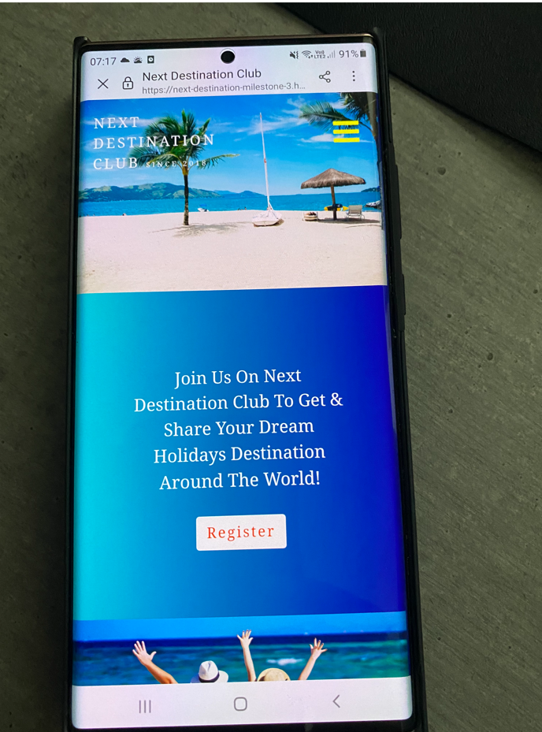

  ## Code Validation Test

  ### HTML

  * To make make it easier to validate html code, since using jinja templating language throughout all pages, which results in errors in online validators.

  * There was no error on any html page but there was warning caused on some of the webpages because of  missing div , section , <h> tags.

  ### CSS Validation

  *  There was error due to I was declare color as :none then I changed it to transparent and check my css code again in css validator ! there was no error left.

    
     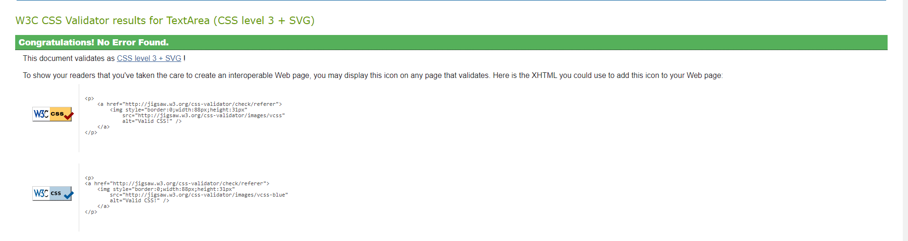

 
  ### Javascript Validation

  * JSHint Results
   
  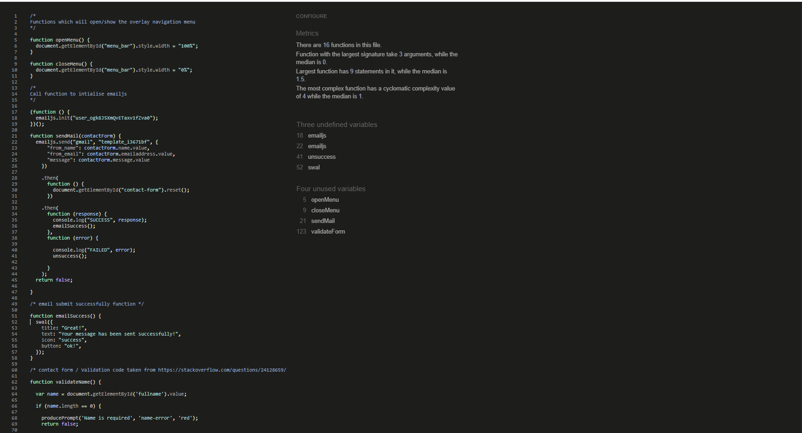

  ### Python 

  * PEP8 Online results

  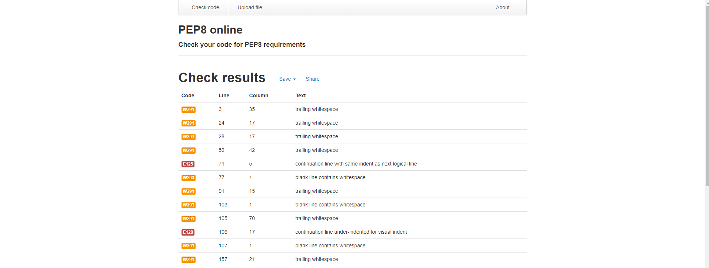

## User Stories Testing
 
  ### First Time Visitor Goals 

  *  As a first time visitor, I want the site navigation to be intutive, user friendly and easy to get on destination.
     App has a  full page overlay menu navbar that is present wherever page (even if visitor scrolls down) the visitor can looking at 
     menu bar and it is clearly displaying all pages/links for a new user to make navigation through the site easy and effortless.

     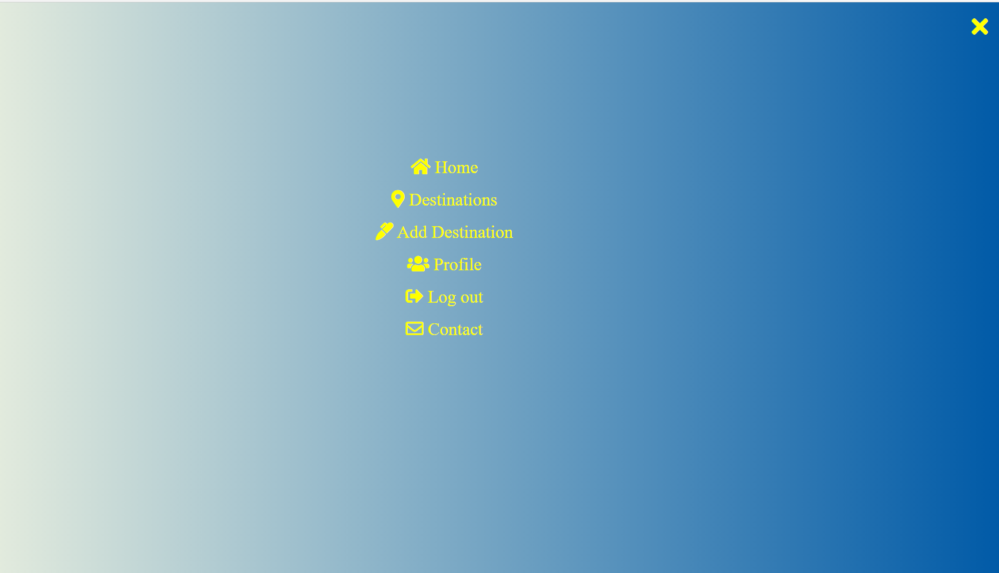
    
     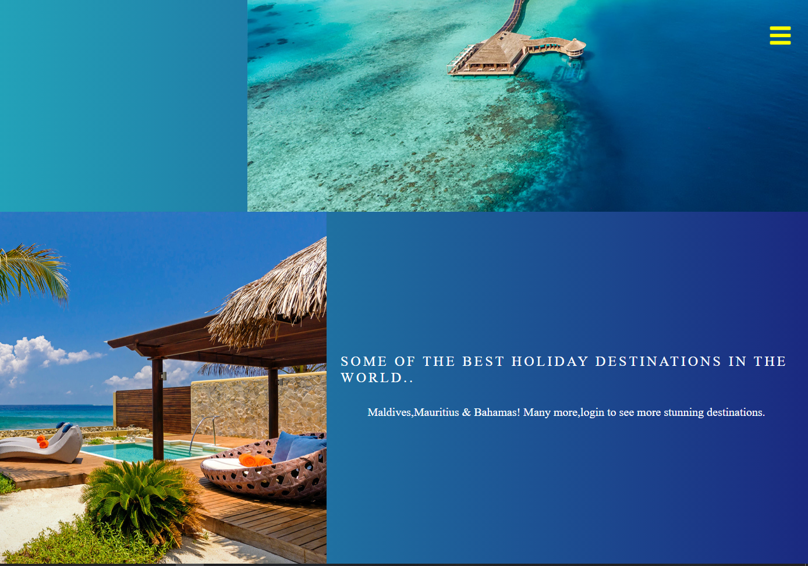

  *  As a first time visitor, I want to easily understand the main purpose of the App.
     When visitor enters website, the visitors is welcomed by a some stunning images and content another thing a really clean header 
     with menu icon and content of the home page that clealy explains the purpose of the site.

  *  As a first time visitor, I want to be able to create, read, update, delete and search for destinations.
     There is a register button at Home page that will redirect visitor to Register page. Once visitor register safly and they can access all the pages and to see the  
     destinations and discription to click on image title and  they can start create there own. When visitor created a destination, visitor is allowed to edit and delete.

     

  *  As a first time visitor, I want to contact information or social media links to be able to contact author, and feel free to send response about site.
     There is contact form link it has provided both in menu bar and footer nav links.

     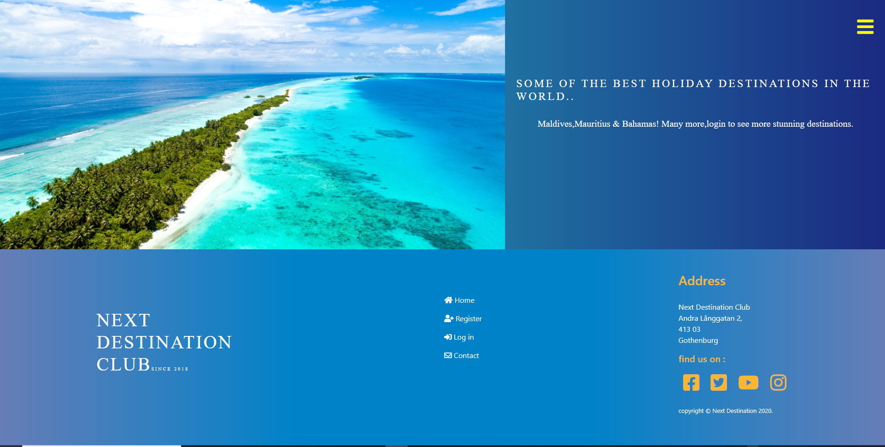

  ### Returning Visitor Goals

   * As a returning visitor, I want to be able to easily log in, if I already registered last time visiting.
     Visitor can click on Log In link on menu bar or footer nav link it will redirect to Log In page.

   * As a returning visitor, I want to be able to create, read, update, delete my profile data.
     I want full access on my Account, visitor can update their user name and password full securly.

   *  As a returning visitor, I want able to contact the author of the site to send some feedback 
     releated weppage.

   * As a returning visitor, I want to be able to create, read, update, delete my own destinations.

  ### Frequent Visitor Goals

  * As a frequent visitor, I want to be smoothly and fastly add destination.

  * As a frequent visitor; destinations continuously updated with newly added destinations by other users and author of the site as well.
  
    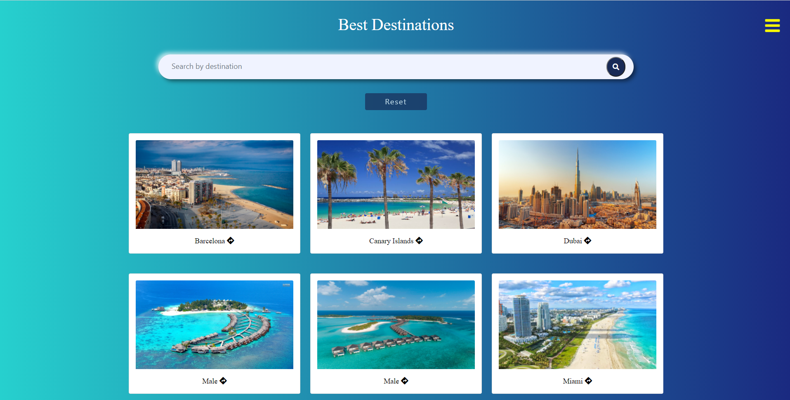

# Error found during site development

   ### The developer face several issues during the development of the site ,Some of the issues below I got During my site development :-

   * During the site development I found the error in index.html ( webpage left margin in some of the images ) even I used margin 0 padding 0 in external css to removes all  
    default margin and padding for every object on the page but it did not helped.

   * I decided to decrease the left margin below 0 { margin-left:-15px;}. After when I inculde this line of code error was resolved.

   * During the site development I found some issue with search bar! I tried to create index for search query but i could not success to create, I was seaching 
    by destination_name and country. I tried both python3 shell and mongoDb  to create index but no success! then I contact  tutor support to resolve this issue.
    my tutor and me we was nearly 2 hours struggling with this search query. every time it throw  lanaguage override error (pymongo.error.operationFailure)

     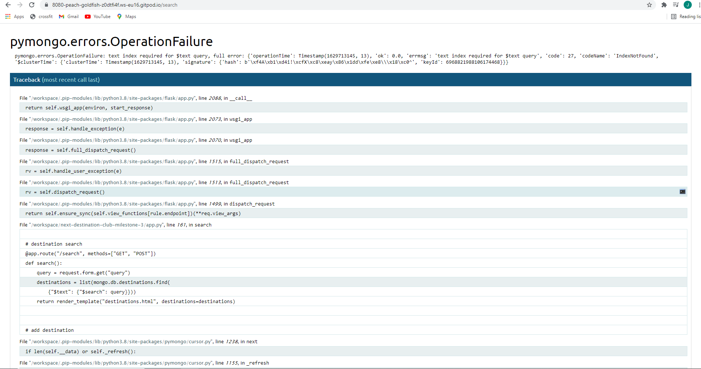

   *  Finally after struggling a few hours we able to resolve this issue to add this code ! 

      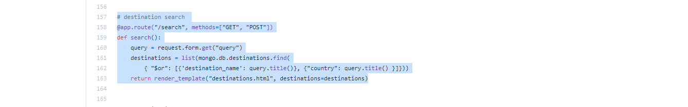

  *  During the site development I found issue with my full page overlay nav menu ! Carousel on home page started overlap on menu bar en same error was on registration form
     and login form! then I find out why its overlape to solve this issue I include this code

     nav-bar {z-index : 200}
     overlay-menu {z-index:300}

  *  During the site development I have some issue with my workspace Gitpod! my workspace went in stopping mode and it showed me message I have not enough credit.
     To resolve this issue I contact the tutor support , they put me in unlimited credit so my workspace worked as normal.

# Performance Testing
    
  ## Google Lighthouse Testing

  * I have used lighthouse tool to check the performance of website. Here is link [Lighthouse](https://developers.google.com)

    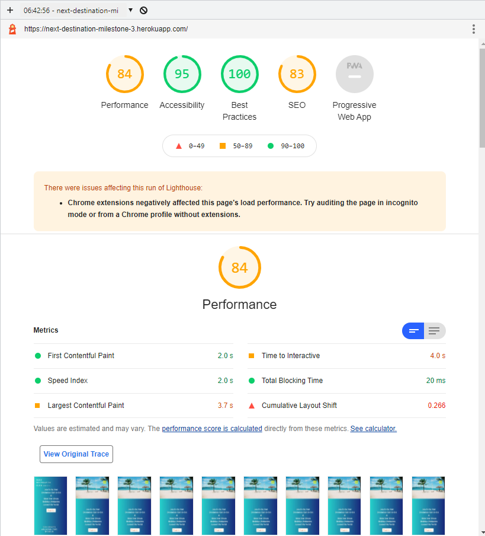

    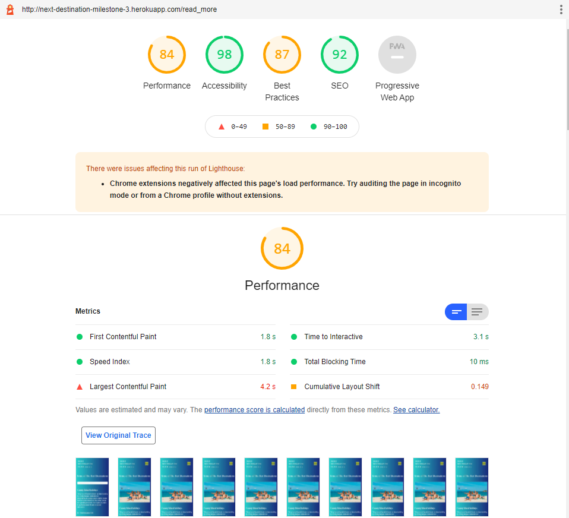

    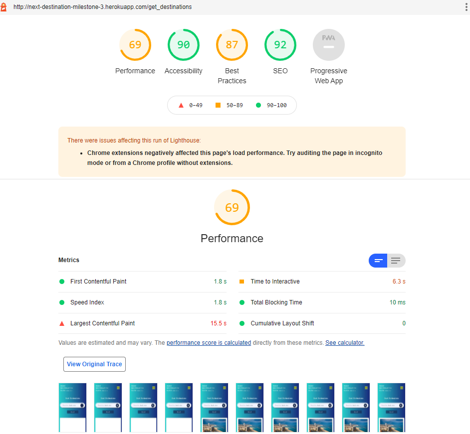

  
# Deployment 

  
  
 ## Version control

 The project was deployed on GitHub Pages. I used Gitpod as a work space where I commited all changes to git version control system. 
 I used push command in Gitpod to save changes into GitHub.

## Github

  ### To run localy

   * Log in to GitHub and click on repository to download ([Milestone Project 3](https://github.com/jas-sin82/next-destination-club-milestone-3)).
   
   * Select `Code` and click Download the ZIP file.
   
   * After download you can extract the file and use in your local environment.
   
   * Second option is you can [Clone](https://docs.github.com/en/github/creating-cloning-and-archiving-repositories/cloning-a-repository-from-github/cloning-a-repository)
     or [fork](https://docs.github.com/en/get-started/quickstart/fork-a-repo) this repository ([Milestone Project 3](https://github.com/jas-sin82/next-destination-club-milestone-3)) into your github account.

## Heroku

  This project is live and automatically deployed to Heroku. The following steps outline the necessary steps to set-up and deploy a project that uses Python alongside MongoDB.
  
  * Before deploying your project create a requirements.txt file by running the following command in the CLI

         pip3 freeze --local > requirements.txt

   * Create a Procfile file by running the following command in the CLI

         echo web: python app.py > Procfile 

   * Once theses files have been correctly created commit and push these to your GitHub repository.

   * Create an account/log in to your Heroku account.

   * select "New App"

     

   * write your project name (make sure it must be unique ) and select your region, and then click "Create app.

     

   * You will directly to the deploy screen for your project.To connect directly to your GitHub repository select the deployment
     method ( Git Hub conncect to Git Hub)
     

      

   * After you connected to your repository, click on "Settings" tab on your app dashboard, and click on "Reveal Config Vars"  
     add your configuration variables to Heroku.

   * Then back to the deploy tab and select "Enable Automatic Deploys" and from Manual deploy choose your master branch, and click "Deploy Branch

      

  *  Success message will appear your app is successfully deployed, to live view click on View.

# Credits 

  * Code Institute tutor support.

  * Students on Slack for a helping hand when I've got stuck.

  * My mentor gbenga_mentor for helpfull feedback througout the project.

## Hints & Ideas

  * W3Schools https://www.w3schools.com

  * https://www.python.org/

  * https://flask.palletsprojects.com/en/2.0.x/

  * https://stackoverflow.com/
     
## To finish this project I have used [Code Institute gitpod full template](https://github.com/Code-Institute-Org/gitpod-full-template) 

# Responisve Screenshots 

  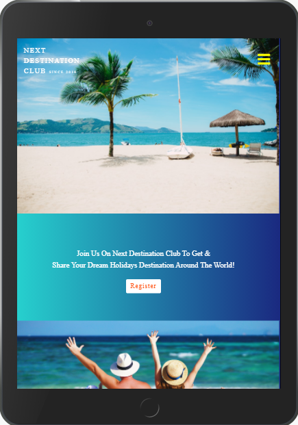

   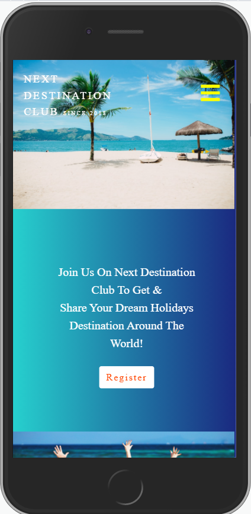

 

    

     

     
     
       

